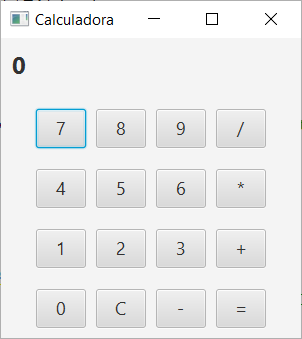
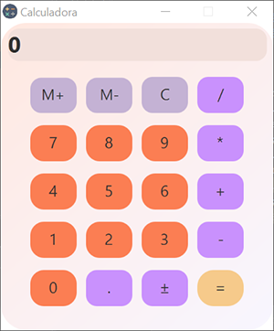

# Práctica 7.2 Calculadora en JavaFX

## Parte 1
Partiendo del ejercicio anterior crea una **calculadora sencilla** en JavaFX utilizando las operaciones habituales (suma, resta, multiplicación y división) así como un botón de reseteo:

- Ayúdate para ello del editor de Scene Builder y crea un contenedor *VBox* con tantas filas de *HBox* como filas de botoneras vayas a crear, con espacio entre ellas, así como un display superior.

## Parte 2

Mejora la calculadora anterior aplicándole estilos CSS para mejorar su apariencia y para que admita la utilización de **decimales** con un botón para ello:

- Agrega estilo y colores mediante *CSS*, tendiendo en cuenta su **usabilidad/accesibilidad**. Se adjunta un ejemplo (no copiar literalmente, usar un estilo propio basándose en la accesibilidad ya estudiada)

- Agrega un botón para el tratamiento de números decimales.

- Deberá de tener también un botón de **memoria** de resultados y otro para cambiar el **signo** de los operandos en otra fila superior.

